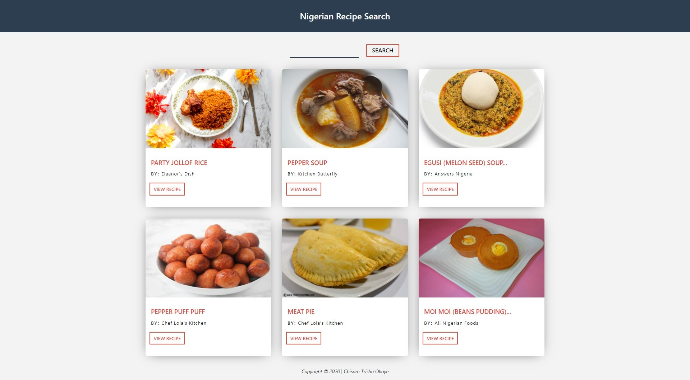
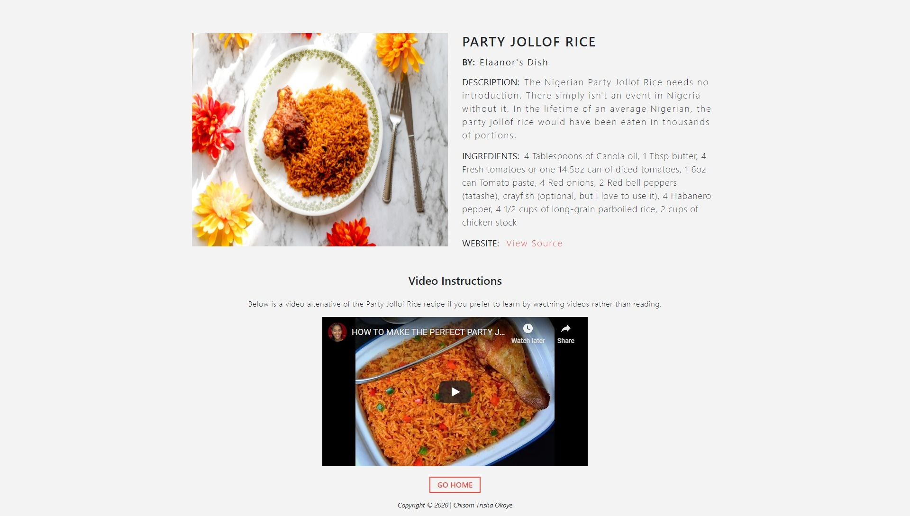

# Nigerian Recipe Search App

## About

A Nigerian recipe finder application built using ReactJS. This is sort of a repository of my tested and trusted Nigerian recipes which will continue to grow as I try out more recipes.

## How to Use

- Search for recipe by typing in keyword and clicking on the Search Button
- Click on View Recipe button to view recipe details
- Read about the recipe, click on view source to view detailed preparation instructions or watch video on youtube
- Click on Go Home button to return to home page

## Technologies Used

- React JS
- React Router
- Bootstrap
- Media Queries
- Local JSON Data Storage
- Git Version Control
- GitHub Deployment

## Screenshots

<!-- ## Challenges & Solutions

In the project directory, you can run:

### `DangerButton.js` -->
